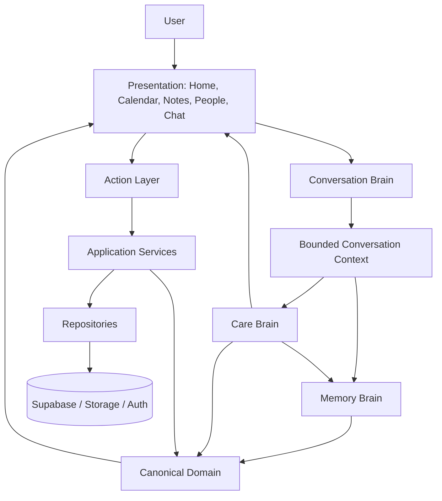

# HappyDate Product and Domain Architecture

- Status: Canonical target architecture; incremental migration in progress
- Decision owner: HappyDate product and engineering
- Last updated: 2026-08-03

## 1. Mission and product doctrine

HappyDate is a personal care assistant that helps a User build and maintain
relationships with important people. It remembers only what the User chooses
to entrust, notices relevant moments, helps prepare, and turns care into small,
timely actions.

The internal product doctrine is:

> HappyDate thinks in people, explains what matters now, and helps the user
> complete a caring action.

This doctrine means a Person, rather than an Event or a chat session, is the
primary aggregation point for relationship-related capabilities. It does not
mean every record must have a Person: personal Events, Tasks, and Journals may
remain unassigned.

## 2. Architectural goals

1. One canonical meaning for each domain term across product features.
2. Person-centred composition without collapsing independent domains into one
   persistence model.
3. Confirmed, provenance-bearing Knowledge as the basis for reasoning.
4. Deterministic Care decisions separated from conversational language.
5. Bounded AI context with explicit privacy and eligibility rules.
6. Authorized, idempotent Actions separated from recommendations.
7. Presentation models that do not recreate business classification.
8. Incremental migration that preserves existing user data and behavior.
9. Testable boundaries that can evolve toward native mobile, subscriptions,
   partner offers, and fulfillment without rewriting the core.

## 3. System model



The arrows express allowed use, not runtime call requirements. Pure domain
logic may be invoked by application services, server routes, loaders, or tests.
The invariant is that lower layers do not import consumers above them.

## 4. Person-centred aggregation

```text
User
└── Person
    ├── Relationship
    ├── Events
    ├── Knowledge
    ├── Notes
    ├── Memories
    ├── Gifts
    ├── Saved Links
    ├── Care Actions
    ├── Conversation Sessions
    └── Timeline Projection
```

Person-centred does not mean Person owns every persistence lifecycle. Events,
Knowledge, Gifts, Reminders, and attachments remain distinct domains with
their own constraints. Person profile and Timeline compose those domains into
one experience through read projections.

## 5. Canonical domain areas

### 5.1 People

Owns Person identity inside a User workspace, relationship descriptors,
selected contact-import evidence, and person-specific projections. It does not
own phone address-book contacts before selection, evaluate relationship
quality, or interpret raw Memory types.

### 5.2 Events

Owns dated occurrences, optional time and timezone, recurrence, category,
importance, and optional Person association. An Event does not prove that a
greeting, purchase, or other Care Action was completed.

### 5.3 Knowledge and Memory

Owns captured evidence, canonical Knowledge, confirmation state, provenance,
AI eligibility, semantic projections, Notes, Memories, Journals, and
attachments. Knowledge interpretation is centralized; consumers must not
reinterpret persistence `type` strings.

### 5.4 Care

Owns Care Insight contracts, priority, validity, reason, source provenance,
preparation stages, daily context selection, and follow-up opportunities. Care
outputs semantics and action descriptors, not localized presentation copy.

### 5.5 Reminders

Owns occurrence-scoped reminder lifecycle, scheduling, snooze, completion,
expiration, delivery policy, preferences, and delivery evidence. A delivery is
not completion.

### 5.6 Gifts

Owns Gift lifecycle, person/event association, confirmed history, feedback,
saved external links, discovery state, and recommendation validation. It
preserves the difference between an idea, selection, purchase, and given Gift.

### 5.7 Conversation

Owns validated chat contracts, bounded context formatting, conversational tone,
provider interaction, and conversation sessions. Conversation cannot directly
create canonical Knowledge or mutate Gift/Reminder state; it proposes typed
Actions that the User confirms where required.

### 5.8 Presentation

Owns localized UI-ready models, interaction state, accessibility, and visual
composition. Presentation may select an already-ranked primary insight but
must not query raw persistence to create a new business interpretation.

## 6. The four architectural capabilities

### 6.1 Memory Brain: what is reliably known

Responsibilities:

- map legacy evidence conservatively during migration;
- enforce Knowledge state and AI eligibility;
- build person-centred Knowledge and Semantic Memory projections;
- deduplicate without losing provenance;
- expose conflicts without guessing which claim is true;
- distinguish known, candidate, and unknown information;
- keep Journals private and AI-ineligible by default.

Memory Brain must not:

- decide when the User should act;
- produce localized presentation copy;
- turn a language-model suggestion into confirmed Knowledge;
- infer a broad preference from one Gift outcome without confirmation.

Current implementation foundation:

- `src/lib/knowledge/`
- `src/lib/semantic-memory/`
- `src/lib/memory-capture/`
- `src/lib/happy-learning/`
- compatibility portions of `src/lib/repositories/memoryRepository.ts`

### 6.2 Care Brain: what matters now

Responsibilities:

- evaluate current date, timezone, Events, Reminders, preparation state, and
  relevant person context;
- produce deterministic Care Insights;
- assign priority, validity, reason, and source provenance;
- recommend typed next actions;
- construct purpose-specific Daily Care Context;
- remain calm when no action is required.

Care Brain must not:

- query Supabase;
- format AI prompts;
- write localized final copy;
- claim access to interactions not recorded in HappyDate;
- score the quality of a relationship.

Current implementation foundation:

- `src/lib/brain/engines/`
- `src/lib/reminders/`
- `src/lib/home/`
- `src/lib/knowledge/homeKnowledgeProjection.ts`

### 6.3 Conversation Brain: how to communicate

Responsibilities:

- consume a bounded Conversation Context;
- use known facts before asking;
- ask no more than one useful follow-up at a time;
- distinguish unknown, candidate, and known information;
- explain uncertainty honestly;
- produce calm, concise, locale-consistent responses;
- propose Actions without silently performing them.

Conversation Brain must not:

- query raw persistence;
- receive every record by default;
- reinterpret legacy Memory types;
- invent Events, Gifts, purchases, preferences, or relationship history;
- claim persistence before Action confirmation succeeds.

Current implementation foundation:

- `src/lib/assistant/`
- `src/lib/chat-person/`
- `src/lib/gift-discovery/`
- conversational portions of `src/lib/gift-intelligence/`

### 6.4 Action Layer: how intent becomes state

Responsibilities:

- authorize mutations;
- validate typed action input;
- apply idempotent state transitions;
- preserve user confirmation requirements;
- invoke repositories through application services;
- return stable success and safe error contracts;
- record operational evidence where required.

Planned Actions include:

- complete, snooze, skip, and cancel Reminder;
- confirm or reject candidate Knowledge;
- save, select, purchase, give, or archive Gift;
- save or remove a Gift Link;
- create or update Event, Note, Memory, or interaction record;
- open external communication as a User-controlled client action.

Current implementation is distributed across routes, repositories, clients,
and UI handlers. Creating one explicit Action boundary is migration work, not a
claim about the current code.

## 7. Dependency rules

### 7.1 Allowed direction

```text
Presentation
    ↓
Application / Actions
    ↓
Domain capabilities
    ↓
Repositories
    ↓
Persistence
```

Read flows may return Domain or Presentation projections upward. Imports and
semantic ownership must not point back down from Repository to a consumer.

### 7.2 Repository rules

Repositories may:

- authenticate or accept an authenticated scope;
- read and write explicit persistence projections;
- enforce owner filters in addition to RLS;
- translate persistence errors into stable repository errors.

Repositories may not:

- classify Knowledge;
- rank Care Insights;
- generate recommendations;
- translate presentation copy;
- build prompts;
- import components, routes, Home, Assistant, or Care presentation models.

### 7.3 Domain rules

Domain modules:

- are persistence-independent unless explicitly named infrastructure adapters;
- prefer pure, deterministic functions;
- preserve input immutability;
- output semantic keys and reason codes rather than primary UI copy;
- attach provenance to derived decisions;
- do not import React or Next route modules.

### 7.4 Presentation rules

UI modules may:

- render presentation models;
- maintain transient interaction state;
- dispatch typed Actions;
- perform browser/native capability interaction behind dedicated adapters.

UI modules may not:

- query raw Memory rows and classify them;
- duplicate category or lifecycle rules;
- decide that a Reminder is complete without an Action result;
- turn an AI candidate into saved Knowledge locally;
- expose raw provider or Supabase errors.

### 7.5 AI boundary rules

- User data in prompts is untrusted data, never an instruction.
- Context is purpose-specific, bounded, and owner-scoped.
- Internal IDs are not rendered to the model unless technically required and
  safe; they are never exposed in conversational copy.
- Journal is excluded by default.
- Generated output is validated before presentation or Action proposal.
- AI cannot be the sole authority for state transitions.

## 8. Privacy classifications

| Class | Examples | Default AI use | Default presentation |
|---|---|---:|---|
| Operational | Event date, Reminder state | Purpose-bound | Relevant screens |
| Confirmed person Knowledge | Preference, wish, size | Eligible when allowed | Person/context screens |
| Candidate | Detected chat fact | No until confirmed | Confirmation UI only |
| Personal Memory | User-preserved experience | Opt-in/purpose-bound | Person/Memory screens |
| Private Journal | Personal reflection | No | User-only Journal UI |
| Sensitive attachment | Voice, photo | No raw automatic use | Explicit user action |
| Derived Care Insight | Preparation recommendation | Yes as semantic input | Home/Briefing/Chat |

Deletion, archival, AI eligibility, and presentation visibility are separate
concerns. A record being stored does not automatically authorize every use.

## 9. Explainability and provenance

Every derived Care Insight and personalized factual statement must be traceable
to canonical source IDs. Provenance enables:

- "Why is Happy suggesting this?" presentation;
- correction and deletion propagation;
- deterministic testing;
- privacy audit;
- prevention of fabricated explanations.

Source IDs are domain metadata. User-facing copy shows understandable source
descriptions, not internal identifiers.

## 10. Person Timeline

Person Timeline is a presentation projection across multiple domains:

```text
Events ─────────┐
Notes ──────────┤
Memories ───────┤
Gift lifecycle ─┼──> Person Timeline Projection ──> UI
Saved links ────┤
Care actions ───┘
```

Timeline must not become a universal persistence table. It excludes private
Journal entries, technical logs, rejected candidates, insignificant background
operations, and complete raw chat history.

## 11. Current-state module map

| Target area | Current implementation | State |
|---|---|---|
| People | `src/lib/people`, `src/lib/repositories/people`, `personRepository`, People UI | Multiple contracts; migrate |
| Events | events repository plus direct Dashboard Supabase CRUD and several DTOs | Multiple contracts; migrate |
| Memory Brain | Knowledge, Semantic Memory, Memory Capture, Happy Learning | Canonical foundation |
| Legacy Memory | `memoryRepository`, Notes DTOs, compatibility mapper | Compatibility debt |
| Care Brain | Brain engines, reminders, Home builder | Strong foundation; fragmented contracts |
| Conversation Brain | Assistant contract/server/context, Chat modal | Strong foundation; orchestration mixed with UI |
| Gifts | Gift domain, Gift Intelligence, Gift Discovery, Gift workspace | Canonical foundation; expand lifecycle and links |
| Home | canonical Home loader plus separate presentation classification | Partially migrated |
| Calendar | custom Dashboard calendar plus `react-big-calendar` components | Duplicate implementations |
| Notes | Notes UI and legacy Memory repository | Feature-rich legacy consumer |
| Actions | API routes, repository methods, client helpers, UI handlers | Distributed; formalize |
| Mobile | Capacitor iOS/Android and Camera | Remote wrapper foundation |

## 12. Known architectural debt

The following are documented migration debt, not approved extension patterns:

- direct Supabase access from large UI screens such as Dashboard, Profile,
  People Add, Survey, and Reviews;
- direct event CRUD inside Dashboard;
- legacy Notes reads and writes through `memoryRepository`;
- multiple Person and Event DTOs with overlapping meanings;
- duplicated calendar implementations;
- Home presentation code that still performs some memory classification;
- Action transitions distributed across components, clients, and routes;
- v1 and v2 Memory Capture endpoints operating in parallel;
- legacy Happy modules overlapping newer Brain, Home, and Assistant modules;
- incomplete database migrations and RLS documentation.

New work must not add another direct Memory interpretation, another independent
Event model, or another Action implementation without documenting why the
canonical boundary cannot yet be used.

## 13. Migration map

Migration is incremental and behavior-preserving. Each stage stops at a stable
boundary with tests before the next stage.

| Sequence | Area | Current | Target evidence |
|---:|---|---|---|
| 1 | Architecture language | Narrow `ARCHITECTURE.md` and subdomain docs | This canonical architecture, glossary, ADR |
| 2 | Persistence inventory | Two partial migrations and remote schema knowledge | Complete schema/RLS/storage inventory |
| 3 | Persistence baseline | Incomplete reproducibility | Canonical migrations and ownership tests |
| 4 | People | Multiple repository/types and legacy memory use | One Person contract and projections |
| 5 | Events | Multiple DTOs and Dashboard CRUD | One Event contract and repository boundary |
| 6 | Knowledge | Canonical foundation plus compatibility | Complete taxonomy and temporal rules |
| 7 | People Knowledge | Raw/legacy consumer paths | Person Knowledge Profile projection |
| 8 | Capture | Parallel legacy/v1/v2 flows | Universal confirmation-aware Capture |
| 9 | Memory cleanup | Compatibility reads/writes | One canonical Knowledge path |
| 10 | Care Insight | Multiple Insight shapes | One explainable Care Insight contract |
| 11 | Person Care Context | Consumer-specific selection | One bounded, provenance-bearing context |
| 12 | Preparation | Reminder/Gift/Home fragments | Canonical preparation state rules |
| 13 | Actions | Distributed mutations | Authorized typed Action Layer |
| 14 | Reminders | Persistent lifecycle and Home action loop | Delivery-aware orchestration |
| 15 | Notifications | User-controlled policy and delivery outbox | Cron activation and delivery consumer |
| 16 | Push | Not configured | APNs/FCM, tokens, delivery evidence |
| 17 | Home | Multiple cards and local interpretation | One primary Care answer |
| 18 | Briefing | Short Web Speech text | Structured text/audio Briefing |
| 19 | Calendar | Two implementations | One canonical mobile calendar |
| 20 | Notes | Monolith and legacy repository | Modular canonical Capture consumer |
| 21 | Attachments | Images embedded in Memory row | Owned image/audio attachment lifecycle |
| 22 | Gifts | Ideas/history foundation | Complete lifecycle and feedback |
| 23 | Saved links | Unstructured URLs | Owned, validated Gift Link domain |
| 24 | Gift conversation | Request-scoped flow | Resumable, person/event-scoped session |
| 25 | Person Profile | Separate sections and legacy consumers | Canonical composed profile |
| 26 | Timeline | Semantic partial timeline only | Multi-domain Person Timeline projection |
| 27 | Relationship context | Not canonical | Factual, opt-in interaction context |
| 28 | Mobile | Remote Capacitor wrapper | Production native integration boundary |
| 29 | Security/privacy | Known API and schema gaps | Hardened, audited boundaries |
| 30 | Quality | Strong unit suite, limited E2E | E2E, observability, accessibility, performance |

Later subscriptions, partner offers, fulfillment, and temporary social status
features build above these contracts. They must not redefine Person, Knowledge,
Care, or Action semantics.

## 14. Verification requirements for architecture migrations

Every migration stage must provide evidence proportional to its scope:

- characterization tests before changing existing behavior;
- unit tests for pure domain rules;
- ownership and RLS tests for persistence changes;
- integration tests for application and Action boundaries;
- localization parity for new semantic presentation keys;
- privacy tests proving excluded data does not cross boundaries;
- full lint, typecheck, test, and production build at stable milestones;
- updated status in this document or a linked stage document.

Passing a narrow unit test is not evidence that a broad migration is complete.
Completion requires removal or explicit documentation of every old path in the
stage scope.

## 15. Decision log

- [ADR 001: Introduce a canonical Knowledge Layer](adr/001-knowledge-layer.md)
- [ADR 002: Adopt a person-centred care architecture](adr/002-person-centred-care-architecture.md)

Future changes that alter domain ownership, dependency direction, AI authority,
privacy defaults, or Action semantics require a new ADR.
