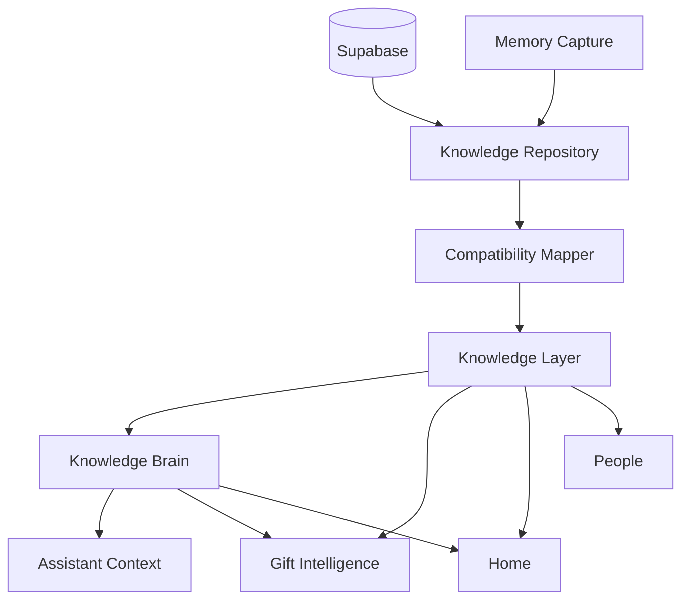

# Happy Knowledge System 1.0 — Dependency Architecture

- Status: Target architecture approved; migration in progress
- Last updated: 2026-07-17

## Target dependency graph



No consumer has a reverse or side-channel dependency on Repository or Supabase.
Those modules receive Knowledge projections or use an application service; they
do not query or reinterpret persistence records themselves.

## Dependency direction

```text
Supabase
    ↓
Knowledge Repository
    ↓
Compatibility Mapper
    ↓
Knowledge Layer
    ↓
Knowledge Brain
    ├── Assistant Context
    ├── Gift Intelligence
    └── Home insights

Knowledge Layer
    ├── People knowledge view
    └── other purpose-specific projections

Memory Capture
    ↓
Knowledge Repository
```

Dependencies always point downward toward stable domain contracts. Repository
does not import or call Brain, Assistant, Gift Intelligence, Home, People UI,
components, routes, or presentation models.

## Responsibilities

### Knowledge Repository

- Authenticated Supabase reads and writes.
- Explicit persistence projections.
- Basic persistence DTOs and error boundaries.
- No classification, scoring, recommendations, presentation, or prompts.

### Compatibility Mapper

- Converts historical `MemoryRow` records into canonical `KnowledgeItem` data.
- Preserves legacy type and source evidence.
- Applies conservative, audited compatibility rules.
- Does not access Supabase or product consumers.

### Knowledge Layer

- Canonical person-centred domain model.
- Privacy and AI-eligibility rules.
- Person profiles and purpose-specific context selection.
- Future home for deduplication, conflict resolution, provenance, and temporal
  validity.

### Knowledge Brain

- Interprets canonical Knowledge for insights and decisions.
- Does not read `MemoryRow` or query Supabase.
- Produces semantic outputs rather than presentation copy.

### Assistant Context

- Requests a bounded purpose-specific Knowledge/Brain context.
- Formats trusted system instructions separately from untrusted user data.
- Does not classify legacy memory types or query Supabase directly.

### Gift Intelligence

- Uses canonical preferences, dislikes, wishes, sizes, experiences, and gift
  history.
- Does not invent knowledge or maintain a separate preference taxonomy.

### Home

- Consumes Knowledge/Brain insights and presentation adapters.
- Does not query `memories` directly after its migration stage.

### People

- Renders a person-centred Knowledge view.
- Does not aggregate or classify raw memories after its migration stage.

### Memory Capture

- Captures original input and submits a Knowledge write request.
- Does not require users to understand internal categories.
- Classification and confirmation remain separate from persistence access.

## Migration status

| Area | Status | Current path | Target path |
|---|---|---|---|
| Domain model | Canonical | `KnowledgeItem` | Complete |
| Compatibility mapping | Canonical | `MemoryRow → KnowledgeItem` | Complete |
| Knowledge Layer | Canonical foundation | Read-only projections | Expand incrementally |
| Knowledge Repository | Canonical | Supabase → Knowledge | Complete for Stage 2 |
| Memory Repository | Compatibility | Legacy facade | Remove only during cleanup |
| Dependency audit | Complete | All Memory readers catalogued | Keep document current |
| Brain engines | Canonical | `KnowledgeItem` | Complete for Stage 3 |
| Assistant context | Canonical | Knowledge items with parity adapter | Complete for Stage 3 |
| Gift recommendations | Canonical | Gift Knowledge Context | Complete for Stage 4 |
| Home | Canonical | Knowledge Layer Home projection | Complete for Stage 5 |
| People list/profile | Legacy | `MemoryRow` and Brain mapper | Person Knowledge profile |
| Notes | Legacy UI | Notes-specific projection | Memory Capture transition |
| Memory Capture | Legacy | Structured Notes/care flows | Universal capture flow |

## Direct Supabase access policy

The final architecture permits `memories` table access only inside the
Knowledge Repository. Existing exceptions are migration debt, not approved
extension points.

Currently known exception:

- `src/lib/repositories/home/home.repository.ts` reads `memories` directly. It
  remains unchanged until the dedicated Home stage to preserve current
  behavior.

New code must not add another direct `memories` query outside
`knowledgeRepository.ts` or an explicitly documented legacy compatibility
method.

## Revised staged roadmap

1. ✅ Foundation
2. ✅ Repository
2.5. ✅ Dependency Audit
3. ✅ Knowledge Consumers: Brain + Assistant Context
4. ✅ Gift Intelligence
4.1. ✅ Gift API Ownership Guard
5. ✅ Home
6. ⬜ People
7. ⬜ Memory Capture
8. ⬜ Migration hardening and compatibility mode
9. ⬜ Cleanup and documentation finalization

Each stage must preserve external behavior, pass the complete verification
cycle, and stop for approval before the next stage begins.

The complete pre-migration inventory is recorded in
[`stage-2-5-memory-dependency-audit.md`](./stage-2-5-memory-dependency-audit.md).
